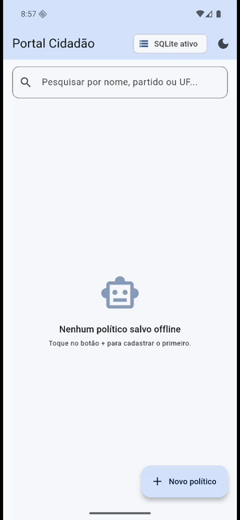

# 🎬 Minha Cinemateca: Filmes Favoritos (Offline)

Aplicativo Flutter didático que demonstra, na prática, **Persistência de Dados Local** combinando duas tecnologias:

| Tecnologia | Para quê usamos | Pacote |
|---|---|---|
| **SQLite** | Dados estruturados: o CRUD de filmes (tabela relacional) | [`sqflite`](https://pub.dev/packages/sqflite) + [`path`](https://pub.dev/packages/path) |
| **SharedPreferences** | Configuração chave-valor: o tema (claro/escuro) **e o último termo de busca** | [`shared_preferences`](https://pub.dev/packages/shared_preferences) |

O usuário pode **cadastrar, listar, pesquisar, editar e remover** filmes da sua coleção — tudo salvo **offline** no dispositivo.

> Este projeto é um **fork adaptado** do app didático [`ADSSTech/persistence_app`](https://github.com/ADSSTech/persistence_app) (originalmente sobre políticos), feito para a tarefa da [issue #2](https://github.com/ADSSTech/persistence_app/issues/2) da disciplina de Desenvolvimento Mobile.

---

## 🎬 Demonstração

O GIF abaixo mostra o app rodando em um emulador Android (Pixel 4, Android 17), na ordem:

1. cadastro de três filmes pelo formulário (**Create**);
2. listagem em ordem alfabética, vinda do SQLite (**Read**);
3. pesquisa por `nolan` — que filtra pelo **diretor**, não só pelo título;
4. troca para o tema escuro;
5. **o app é fechado pela tecla Home e o processo é encerrado de verdade**;
6. ao reabrir, o tema escuro **e** a pesquisa `nolan` voltam sozinhos, com o aviso *"Busca restaurada da última sessão"* — são as duas SharedPreferences em ação;
7. edição do gênero de um filme, do card já na lista (**Update**);
8. remoção com diálogo de confirmação (**Delete**).

<p align="center">
  
</p>

---

## 📱 O que o app faz

1. **Lista** os filmes salvos no banco local (título, diretor, gênero, ano).
2. **Cadastra** um novo filme por um formulário (BottomSheet) com validação.
3. **Pesquisa** por título, diretor, gênero **ou ano** (filtro em tempo real).
4. **Edita** um filme (toque no lápis ou no card) — mesmo formulário, pré-preenchido.
5. **Remove** um filme (com diálogo de confirmação).
6. **Alterna o tema** claro/escuro pela AppBar — e **lembra a escolha** na próxima abertura (SharedPreferences).
7. ⭐ **Lembra o último termo pesquisado**: você fecha o app pesquisando `nolan` e, ao reabrir, a lista **já volta filtrada** com o campo preenchido (SharedPreferences).
8. Mostra um **indicador "SQLite ativo"** na AppBar e **SnackBars** de feedback ao salvar/editar/remover.

> O app cobre o **CRUD completo**: Create (cadastrar), Read (listar/pesquisar), Update (editar) e Delete (remover).

### Estados da tela (via `FutureBuilder`)

| Estado | O que aparece |
|---|---|
| ⏳ Carregando | `CircularProgressIndicator()` |
| 🎞️ Vazio | Ícone amigável + "Nenhum filme salvo offline" |
| 📋 Com dados | `ListView` de `Card`s com avatar da sigla do título e botões de editar/remover |
| ⚠️ Erro | Mensagem de erro amigável |

---

## ⭐ As duas preferências persistidas (SharedPreferences)

A tarefa pedia **uma nova preferência além do tema**. Aqui ela é o **último termo de busca**.

| Preferência | Chave no disco | Tipo | Classe | Default |
|---|---|---|---|---|
| Tema claro/escuro | `is_dark_mode` | `bool` | `ThemePreferences` | `false` (claro) |
| ⭐ Último termo de busca | `ultimo_termo_busca` | `String` | `BuscaPreferences` | `''` (sem filtro) |

### Como o ciclo funciona

```
Usuário digita "nolan" no campo de busca
        │
        ▼
HomePage._aplicarBusca()  ──► setState()              (filtra a lista na tela)
        │                 └─► BuscaPreferences        (grava no disco)
        ▼
        ... usuário FECHA o app ...
        ▼
main() ──► BuscaPreferences().loadUltimoTermo()  ──► "nolan"
        │
        ▼
MinhaCinematecaApp(termoBuscaInicial: "nolan") ──► HomePage já abre filtrada
```

No `initState()` da `HomePage` o `TextEditingController` já nasce com o termo restaurado, e um aviso **"Busca restaurada da última sessão"** aparece abaixo do campo — é a prova visual de que o valor veio do disco, e não da memória.

### Por que isso é uma preferência e não uma tabela?

- **SQLite** → dados **estruturados** e em quantidade: a coleção de filmes, com colunas e tipos.
- **SharedPreferences** → **configuração** simples (chave → valor): estado da interface.

Criar uma tabela SQLite para guardar uma única string seria usar um caminhão para carregar uma carta. Tocar no `X` do campo de busca **remove** a chave em vez de gravar `''`, então o app volta a se comportar como numa instalação nova.

---

## 🧱 Arquitetura (em camadas)

O código **não** fica todo em um arquivo. Cada responsabilidade tem seu lugar — como em um projeto profissional:

```
lib/
├── main.dart                       # Bootstrap: carrega tema + última busca e sobe o app
├── app.dart                        # MaterialApp + gestão do tema (claro/escuro)
│
├── models/
│   └── filme_model.dart            # Entidade IMUTÁVEL. toMap() / fromMap()
│
├── data/                           # Camada de dados (persistência)
│   ├── database_helper.dart        # Singleton do SQLite (abre banco + cria schema)
│   ├── i_filme_repository.dart     # Contrato (interface) do repositório
│   ├── filme_repository.dart       # CRUD (isola o SQL da UI)
│   ├── theme_preferences.dart      # Wrapper do SharedPreferences (tema)
│   └── busca_preferences.dart      # ⭐ Wrapper do SharedPreferences (última busca)
│
└── ui/                             # Camada de apresentação
    ├── home_page.dart              # Tela principal (FutureBuilder + busca)
    └── widgets/
        ├── filme_card.dart         # Card/ListTile de um filme
        ├── filme_form.dart         # Formulário (BottomSheet) com validação
        └── empty_state.dart        # Estado vazio amigável
```

### Por que separar assim?

- **`DatabaseHelper` (Singleton):** garante **uma única conexão** com o arquivo do banco. Abrir o mesmo banco várias vezes em paralelo pode **corromper** o arquivo — o Singleton evita isso.
- **`Repository`:** a tela **não sabe** que existe SQL. Ela pede "insere", "lista", "remove". Isso permite **testar a UI** com um repositório fake e trocar a fonte de dados sem mexer na interface.
- **`Model` imutável:** `toMap()` grava no banco; `fromMap()` reconstrói o objeto ao ler. É a ponte objeto ⇄ linha da tabela.
- **Um wrapper por preferência:** `ThemePreferences` e `BuscaPreferences` centralizam as chaves de string. A UI nunca digita `'ultimo_termo_busca'` na mão.

### Esquema da tabela `filmes`

```sql
CREATE TABLE filmes (
  id      INTEGER PRIMARY KEY AUTOINCREMENT,
  titulo  TEXT NOT NULL,
  diretor TEXT NOT NULL,
  genero  TEXT NOT NULL,
  ano     INTEGER NOT NULL
);
```

São **4 campos além do `id`**. Note que `ano` é **INTEGER**, não TEXT: guardar número como número permite comparar e ordenar corretamente no SQL (`ano > 2000` funciona; com texto, `"1999" > "2000"` daria resultado errado).

O arquivo do banco é `minha_cinemateca.db`, criado na pasta padrão de bancos do dispositivo (`getDatabasesPath()`), e a listagem usa `ORDER BY titulo COLLATE NOCASE ASC` — ordem alfabética ignorando maiúsculas/acentuação de caixa.

### Validação do formulário

| Campo | Regra |
|---|---|
| Título | obrigatório, mínimo 2 caracteres |
| Diretor | obrigatório |
| Gênero | obrigatório |
| Ano | obrigatório, só dígitos (`FilteringTextInputFormatter.digitsOnly`), entre **1888** (o primeiro filme da história) e o ano atual + 5 |

---

## ▶️ Como rodar

### Pré-requisitos
- [Flutter 3.10+](https://docs.flutter.dev/get-started/install) instalado (`flutter doctor` sem erros).
- Um emulador Android, simulador iOS **ou** dispositivo físico conectado.

### Passos

```bash
# 1. Instale as dependências
flutter pub get

# 2. Veja os dispositivos disponíveis
flutter devices

# 3. Rode o app (Android/iOS é o alvo recomendado — o SQLite é nativo lá)
flutter run
```

Para escolher um dispositivo específico:

```bash
flutter run -d <id-do-dispositivo>   # ex.: flutter run -d emulator-5554
```

> **Observação sobre plataformas:** o `sqflite` roda nativamente em **Android** e **iOS**. Em desktop/web ele precisa do pacote auxiliar `sqflite_common_ffi` (usado apenas nos testes deste projeto). Para a demonstração, use **Android ou iOS**.

### Como verificar a persistência na prática

1. Cadastre dois ou três filmes.
2. Pesquise por algo (ex.: `nolan`) e ative o **modo escuro**.
3. **Feche o app de verdade** (não só minimize — use "encerrar" na lista de apps recentes).
4. Abra novamente: os filmes continuam lá (SQLite), o tema continua escuro e a busca **volta aplicada**, com o aviso *"Busca restaurada da última sessão"*.

---

## ✅ Como testar (sem precisar de celular)

O projeto acompanha testes automatizados que provam o funcionamento **sem device físico** (o SQLite roda em memória via `sqflite_common_ffi` e o SharedPreferences via store em memória):

```bash
flutter test
```

Saída esperada:

```
00:02 +19: All tests passed!
```

Os **19 testes** cobrem:

1. **CRUD real no SQLite** (insere → lista → atualiza → remove) e a ordenação do `ORDER BY`.
2. **Mapeamento do modelo** (`toMap`/`fromMap` simétricos, `id` omitido antes do insert) e a sigla do avatar.
3. ⭐ **As duas preferências**: default na primeira execução, gravação lida de volta por uma **nova instância** (prova que foi para o disco) e limpeza do termo em branco.
4. **UI**: estado vazio, lista com dados, filtro de busca, cadastro, edição, remoção com confirmação, recusa de ano inválido — e, para a nova preferência, que **digitar já persiste o termo** e que o app **reabre filtrado** por ele.

Para checar o código estático (lint):

```bash
flutter analyze     # deve retornar: No issues found!
```

---

## 🧭 Roteiro de leitura sugerido (para estudo)

1. `models/filme_model.dart` — como mapeamos objeto ⇄ linha da tabela.
2. `data/database_helper.dart` — Singleton + abertura do banco + criação do schema.
3. `data/filme_repository.dart` — as operações CRUD isoladas da UI.
4. `data/theme_preferences.dart` e `data/busca_preferences.dart` — leitura/escrita de configuração no SharedPreferences.
5. `main.dart` + `app.dart` — carregamento das preferências salvas e montagem do app.
6. `ui/home_page.dart` — o `FutureBuilder` desenhando a lista e reagindo aos estados.

---

## 🔄 O que mudou em relação ao projeto original

| Original (Portal Cidadão) | Este fork (Minha Cinemateca) |
|---|---|
| Tema: políticos | Tema: **filmes** |
| Tabela `politicos` (`nome`, `partido`, `uf`) | Tabela `filmes` (`titulo`, `diretor`, `genero`, `ano`) — 4 campos, sendo um INTEGER |
| Banco `portal_cidadao.db` | Banco `minha_cinemateca.db` |
| `PoliticoModel` / `PoliticoRepository` | `FilmeModel` / `FilmeRepository` |
| Avatar com a sigla do partido | Avatar com a sigla do título (ignora artigos: "Cidade de Deus" → `CD`) |
| 1 preferência (tema) | **2 preferências** (tema + último termo de busca) |
| Busca por nome/partido/UF | Busca por título/diretor/gênero/**ano** |
| 8 testes | **19 testes** |

---

## 📦 Dependências principais

```yaml
dependencies:
  sqflite: ^2.3.3+1          # Banco relacional embarcado (SQLite)
  path: ^1.9.0               # Monta o caminho do arquivo do banco por SO
  shared_preferences: ^2.2.3 # Armazenamento chave-valor (tema + última busca)

dev_dependencies:
  sqflite_common_ffi: ^2.3.3 # SQLite em memória para os testes (desktop/CI)
```

---

Projeto acadêmico — SENAI, Desenvolvimento Mobile (4ª fase, Tecnólogo em ADS).
Fork de [`ADSSTech/persistence_app`](https://github.com/ADSSTech/persistence_app).
